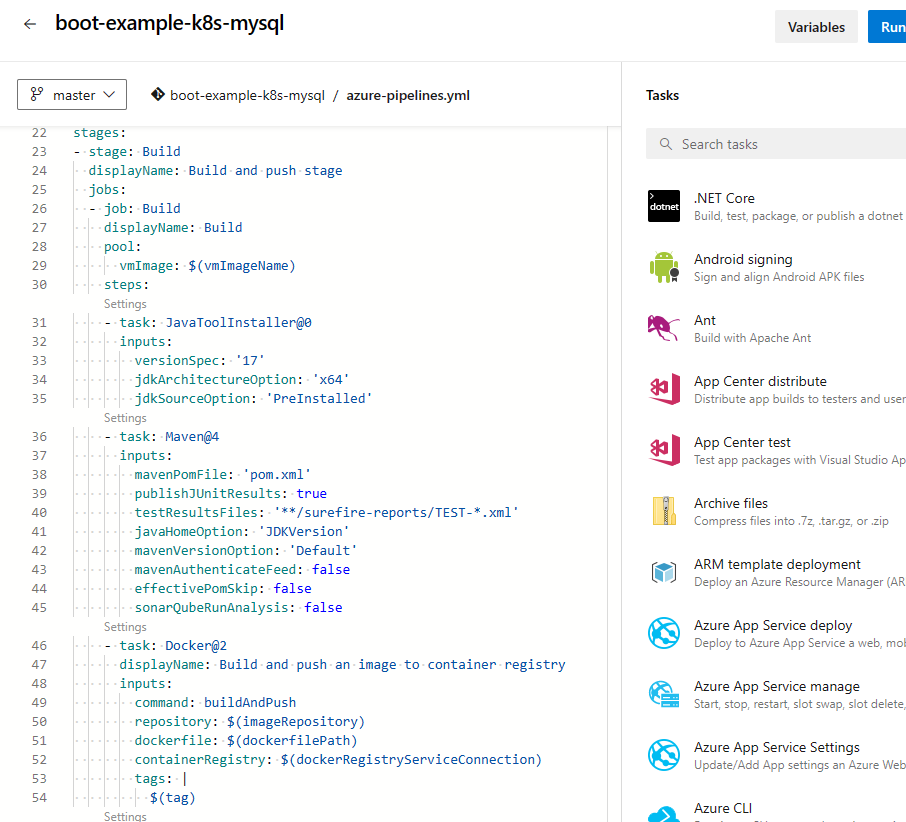
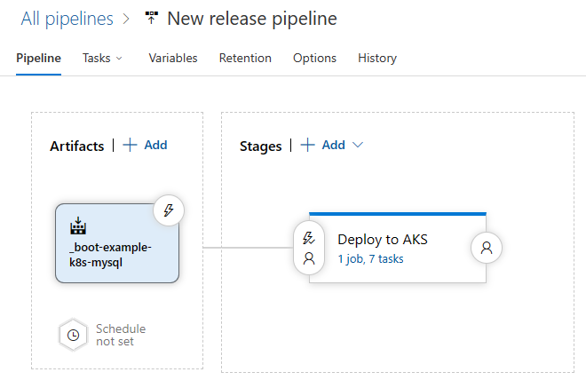
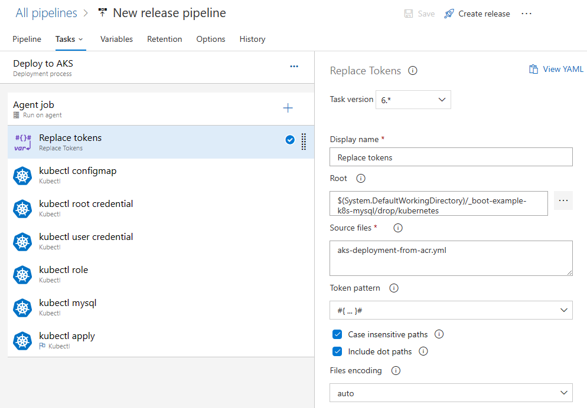
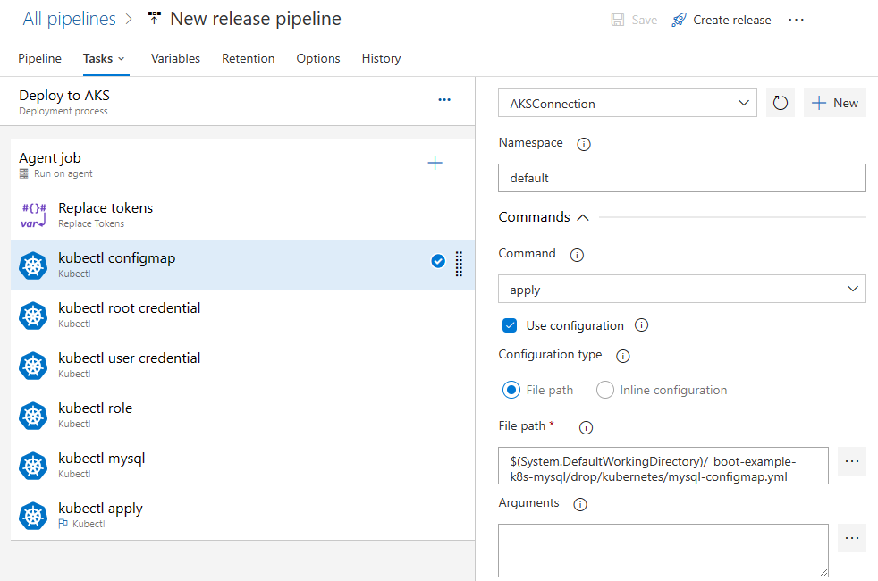
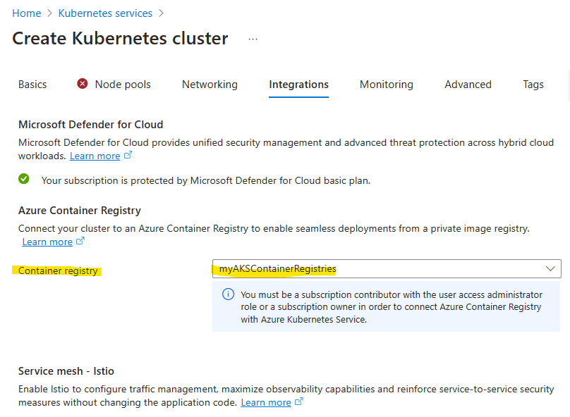

# Expose end point
NOTE: port is set as 32520 as NodePort's port of Kubernetes
* POST `localhost:32520/user/`: adds user object
* GET `localhost:32520/user/` : returns all users
* PUT `localhost:32520/user/{id}`: updates user object
* GET `localhost:32520/user/{id}': returns a single user object or 404 if not found
* DELETE `localhost:32520/user/{id}`: deletes a single user object from db
* POST `localhost:32520/user/search`: search with give name and country

NOTE:
* Application has been developed with DTO pattern
* Application configured solely to deploy in Kubernetes. Not considered local testing. (Not providing profile configuration)

### Create docker image
Run the following command on the root directory of the source code  
`docker build -t boot-example-k8s-mysql .`

### Create MySQL configuration for Kubernetes
In the following sequence,
1. Create configmap yaml
2. Create secret yaml for mysql root credential
3. Create secret yaml for mysql user credential
4. Create deployment yaml to deploy mysql to Kubernetes
5. Deploy the mysql to Kubernetes
* create configmap first `kubernetes/mysql-configmap.yml`
```yaml
apiVersion: v1
kind: ConfigMap
metadata:
  name: db-conf
data:
  host: mysql   # DNS name
  name: test    # Datbase name
```
* create secret for mysql root credential `kubernetes/mysqldb-rooot-credentials.yml`.  
NOTE: password are created with base64 command
```yaml
apiVersion: v1
kind: Secret
metadata:
  name: db-root-credentials
data:
  password: YWRtaW4xMjM=
```
* create secret for mysql user credential `kubernetes/mysqldb-credentials.yml`
```yaml
apiVersion: v1
kind: Secret
metadata:
  name: db-credentials
data:
  username: dGVzdHVzZXI=
  password: dGVzdHVzZXJAMTIz
```
* then create mysql deployment yaml `kubernetes/mysql-deployment.yml`
```yaml
#Define a Service to expose mysql to Other services
apiVersion: v1
kind: Service
metadata:
  name: mysql   # DNS Name
  labels:
    app: mysql
    tier: database
spec:
  ports:
    - port: 3306
      targetPort: 3306
  selector:
    app: mysql    # mysql Pod should contain same labels
    tier: database
  clusterIP: None   # We use DNS, so ClusterIP is not relevant
---
apiVersion: v1
kind: PersistentVolume
metadata:
  name: mysql-pv-volume
  labels:
    type: local
spec:
  storageClassName: manual
  capacity:
    storage: 1Gi
  accessModes:
    - ReadWriteOnce
  hostPath:
    path: "/mnt/data"
---
# Define a Persistent Volume Claim(PVC) for Mysql Storage
apiVersion: v1
kind: PersistentVolumeClaim
metadata:
  name: mysql-pv-claim
  labels:
    app: mysql
    tier: database
spec:
  accessModes:
    - ReadWriteOnce
  resources:
    requests:
      storage: 1Gi
---
# Configure Deployment of mysql server
apiVersion: apps/v1
kind: Deployment
metadata:
  name: mysql
  labels:
    app: mysql
    tier: database
spec:
  selector:
    matchLabels:
      app: mysql
      tier: database
  strategy:
    type: Recreate
  template:
    metadata:
      labels:
        app: mysql
        tier: database
    spec:
      containers:
      - image: mysql:5.7
        name: mysql
        env:
        - name: MYSQL_ROOT_PASSWORD
          valueFrom:
            secretKeyRef:
              name: db-root-credentials
              key: password
        - name: MYSQL_USER
          valueFrom:
            secretKeyRef:
              name: db-credentials
              key: username
        - name: MYSQL_PASSWORD
          valueFrom:
            secretKeyRef:
              name: db-credentials
              key: password
        - name: MYSQL_DATABASE
          valueFrom:
            configMapKeyRef:
              name: db-conf
              key: name
        ports:
          - containerPort: 3306
            name: mysql
        volumeMounts:
          - name: mysql-persistent-storage
            mountPath: /var/lib/mysql
      volumes:
        - name: mysql-persistent-storage
          persistentVolumeClaim:
            claimName: mysql-pv-claim
```
* After start the docker environment, run the following command in sequence from `kubernetes/` directory  
`kubectl apply -f mysql-configmap.yml`  
`kubectl apply -f mysqldb-root-credentials.yml`  
`kubectl apply -f mysqldb-credentials.yml`
`kubectl apply -f mysql-deployment.yml`
* Then you will see running mysql service with `kubectl get all`

### Create app deployment yaml for the Kubernetes
* Create deployment yaml file (it includes deployment and service both) `deployment.yml`
```yaml
apiVersion: v1
kind: Service
metadata:
  name: boot-example-k8s-mysql
  labels:
    name: boot-example-k8s-mysql
spec:
  ports:
    - port: 8080
      targetPort: 8080
      protocol: TCP
      nodePort: 32520
  selector:
    app: boot-example-k8s-mysql
  type: NodePort
---
apiVersion: apps/v1
kind: Deployment
metadata:
  name: boot-example-k8s-mysql
spec:
  selector:
    matchLabels:
      app: boot-example-k8s-mysql
  replicas: 3
  template:
    metadata:
      labels:
        app: boot-example-k8s-mysql
    spec:
      containers:
        - name: boot-example-k8s-mysql
          image: boot-example-k8s-mysql:1.0
          ports:
            - containerPort: 8080
          env:
            - name: DB_HOST
              valueFrom:
                configMapKeyRef:
                  name: db-conf
                  key: host
            - name: DB_NAME
              valueFrom:
                configMapKeyRef:
                  name: db-conf
                  key: name
            - name: DB_USERNAME
              valueFrom:
                secretKeyRef:
                  name: db-credentials
                  key: username
            - name: DB_PASSWORD
              valueFrom:
                secretKeyRef:
                  name: db-credentials
                  key: password 
```
* run the following command to deploy the application to Kubernetes  
`kubectl apply -f deployment.yml`

### Application yaml file
`application.yml` file has the environment variables from Kubernetes deployment yaml file
```yaml
spring:
  application:
    name: boot-example-k8s-mysql
  datasource:
    driver-class-name: com.mysql.cj.jdbc.Driver
#    url: jdbc:mysql://mysql/test
#    username: testuser
#    password: testuser@123
    url: jdbc:mysql://${DB_HOST}/${DB_NAME}
    username: ${DB_USERNAME}
    password: ${DB_PASSWORD}
  jpa:
    database-platform: org.hibernate.dialect.MySQL5Dialect
    generate-ddl: true
    show-sql: true
    hibernate:
      ddl-auto: create
```

### Test
connect to `localhost:32520/user` then you should see the empty response at first.
Then you can add users, search, and delete


# Deployment to Azure Kubernetes Service
##### Difference from Local Kubernetes 
4 yaml files are additionally added for Azure Kubernetes Service
1. Add `Dockerfile-aks` for Azure deployment
```Dockerfile
# platform depends on resource
FROM --platform=linux/arm64 openjdk:17
ADD target/boot-example-k8s-mysql-0.0.1-SNAPSHOT.jar app.jar
ENTRYPOINT ["java", "-jar", "app.jar"]
```
2. Add `kubernetes/aks-mysql-deployment.yml`
```yaml
#Define a Service to expose mysql to Other services
apiVersion: v1
kind: Service
metadata:
  name: mysql   # DNS Name
  labels:
    app: mysql
    tier: database
spec:
  ports:
    - port: 3306
      targetPort: 3306
  selector:
    app: mysql    # mysql Pod should contain same labels
    tier: database
  clusterIP: None   # We use DNS, so ClusterIP is not relevant
---
# Define a Persistent Volume Claim(PVC) for Mysql Storage
apiVersion: v1
kind: PersistentVolumeClaim
metadata:
  name: mysql-pv-claim
  labels:
    app: mysql
    tier: database
spec:
  accessModes:
    - ReadWriteOnce
  storageClassName: managed-premium
  resources:
    requests:
      storage: 1Gi
---
# Configure Deployment of mysql server
apiVersion: apps/v1
kind: Deployment
metadata:
  name: mysql
  labels:
    app: mysql
    tier: database
spec:
  selector:
    matchLabels:
      app: mysql
      tier: database
  strategy:
    type: Recreate
  template:
    metadata:
      labels:
        app: mysql
        tier: database
    spec:
      containers:
      - image: mysql:oraclelinux8
        name: mysql
        env:
        - name: MYSQL_ROOT_PASSWORD
          valueFrom:
            secretKeyRef:
              name: db-root-credentials
              key: password
        - name: MYSQL_USER
          valueFrom:
            secretKeyRef:
              name: db-credentials
              key: username
        - name: MYSQL_PASSWORD
          valueFrom:
            secretKeyRef:
              name: db-credentials
              key: password
        - name: MYSQL_DATABASE
          valueFrom:
            configMapKeyRef:
              name: db-conf
              key: name
        ports:
          - containerPort: 3306
            name: mysql
        volumeMounts:
          - name: mysql-persistent-storage
            mountPath: /var/lib/mysql
      volumes:
        - name: mysql-persistent-storage
          persistentVolumeClaim:
            claimName: mysql-pv-claim
```
3. Add `aks-deployment-from-acr.yml` for Application deployment to Azure Kubernetes Service
```yaml
apiVersion: v1
kind: Service
metadata:
  name: boot-example-k8s-mysql
  labels:
    name: boot-example-k8s-mysql
spec:
  ports:
    - port: 8080
      targetPort: 8080
      protocol: TCP
      nodePort: 32520
  selector:
    app: boot-example-k8s-mysql
  type: LoadBalancer
---
apiVersion: apps/v1
kind: Deployment
metadata:
  name: boot-example-k8s-mysql
spec:
  selector:
    matchLabels:
      app: boot-example-k8s-mysql
  replicas: 3
  template:
    metadata:
      labels:
        app: boot-example-k8s-mysql
    spec:
      containers:
        - name: boot-example-k8s-mysql
          image: <<Container Registries>>.azurecr.io/boot-example-k8s-mysql:#{Build.BuildId}#
          ports:
            - containerPort: 8080
          env:
            - name: DB_HOST
              valueFrom:
                configMapKeyRef:
                  name: db-conf
                  key: host
            - name: DB_NAME
              valueFrom:
                configMapKeyRef:
                  name: db-conf
                  key: name
            - name: DB_USERNAME
              valueFrom:
                secretKeyRef:
                  name: db-credentials
                  key: username
            - name: DB_PASSWORD
              valueFrom:
                secretKeyRef:
                  name: db-credentials
                  key: password
```
4. Add `mysql-role-binding-for-aks.yml` for mysql access
```yaml
apiVersion: rbac.authorization.k8s.io/v1
kind: RoleBinding
metadata:
  name: default-service-account-binding
  namespace: default
roleRef:
  apiGroup: rbac.authorization.k8s.io
  kind: ClusterRole
  name: cluster-admin
subjects:
- kind: ServiceAccount
  name: default
  namespace: default
```

## Create Azure Pipelines/Pipelines
- Create Pipeline with a few additional option
1. JavaToolInstaller Task for JDK 17
2. Maven Task
3. Docker build and publish (given)
4. Copy Files task (for Kubernetes file)
5. Publish build artifact task


## Create Azure Pipelines/Releases
- Create Release Pipeline with configuration files

- Click on 'Tasks' and add 'Replace token' task and 'Kubectl task'
1. Add 'Replace Tokens' for `#{Build.BuildId}#` configuration in aks-deployment-from-acr.yml

2. Add `kubectl apply` configmap

3. Add `kubectl apply` root credentials
4. Add `kubectl apply` user credentials
5. Add `kubectl apply` role
6. Add `kubectl apply` mysql
7. Add `kubectl apply` application deployment

# NOTE
To give access permission for kubernetese process to pull the image from Container Registries,
You should select the Container Registry that you are going to use in 'Integrations' section while create Kubernetes Services

If you missed it while create Azure Kubernetes Service, use the following Azure CLI command to give access  
`az aks update -n AKSCluster -g AKSGroup --attach-acr myAKSContainerRegistries`